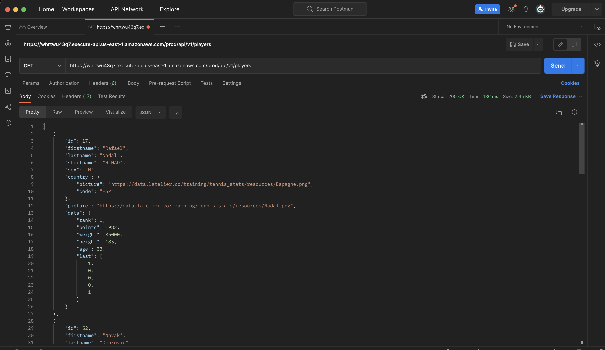
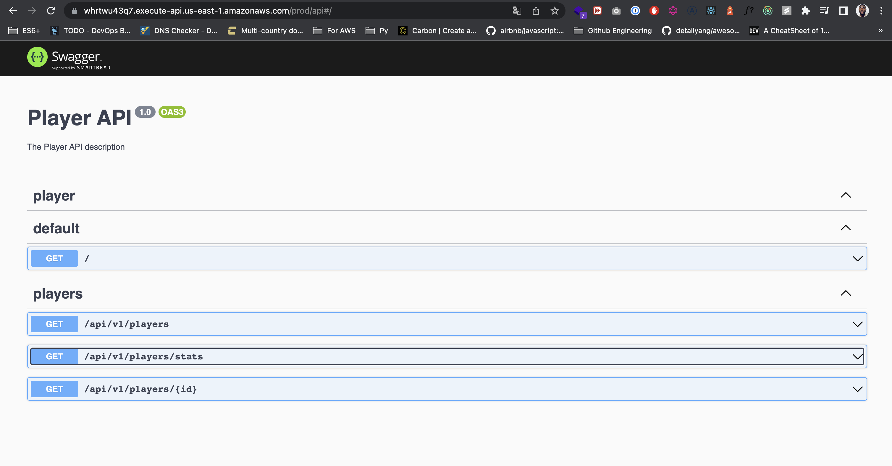

## Description

Player API allows to perform some actions such as :

- List all players: Demo 👉 [here](https://whrtwu43q7.execute-api.us-east-1.amazonaws.com/prod/api/v1/players/)
- Get a player with a given `Id` : Demo 👉 [here](https://whrtwu43q7.execute-api.us-east-1.amazonaws.com/prod/api/v1/players/17)
- Get some players stats : Demo 👉 [here](https://whrtwu43q7.execute-api.us-east-1.amazonaws.com/prod/api/v1/players/stats)
- Basic documentation 👉 [here](https://whrtwu43q7.execute-api.us-east-1.amazonaws.com/prod/api)

## Components

This API is a simple REST API wrapped as a Lambda function, deployed on AWS using Serverless framework and Github Actions pipeline. The following components are used:

- [AWS Lambda](https://aws.amazon.com/fr/lambda/) to wrap the REST API,
- [Amazon S3](https://docs.aws.amazon.com/s3/index.html) to store the list of players in a JSON file inside a Bucket,
- [Amazon API Gateway](https://aws.amazon.com/fr/api-gateway/) which provide tools to route HTTP requests to the lambda functions for our needs.
- [NestJS](https://nestjs.com/) a NodeJS framework
- [Serverless framework](https://www.serverless.com/)

## Installation

```bash
# install node dependencies
$ yarn install
```

## Configurations

To make the API work locally, you must have an AWS account and configure a an AWS profile on your local machine (` in .aws/credentials file`) to be able to access AWS ressources. Once this done, you need to install :

- serverless framework (`npm install -g serverless`)
- AWS CLI : to interact with the AWS cli. See 👉 [here](https://docs.aws.amazon.com/cli/latest/userguide/getting-started-install.html)

Now connect to AWS console and do the following actions

- Create a s3 Bucket and place a JSON file containing all the players. In my case, the `S3_BUCKET_NAME` is equal to `api-players` and the `S3_BUCKET_FILE_NAME` is equal to `player.json`

Once this done, you need to create a .env at the root directory with the following Variables

- `AWS_PROFILE` = Your AWS Profile
- `S3_BUCKET_NAME` = api-players
- `S3_BUCKET_FILE_NAME` = `players.json` (Or another name `.json`)
- `AWS_SETTING_REGION` = Your AWS Region

## Running the app

```bash
# development
$ yarn run start

# watch mode
$ yarn run start:dev

# production mode
$ yarn run start:prod

# deploy for dev stage
$ serverless deploy

# deploy for prod stage
$ serverless deploy --stage prod
```

## Test

```bash
# unit tests
$ yarn run test

# e2e tests
$ yarn run test:e2e

# test coverage
$ yarn run test:cov
```

## Preview




## Todo

- Add more tests cases
- improve the documentation and the Readme

## Stay in touch

- Author - [Foujeu Pavel](https://blog.foujeupavel.com/contact/)

## License

Nest is [MIT licensed](LICENSE).
